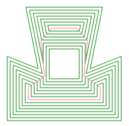

## CGAL_StraightSkeleton_Wrapper

A C# wrapper around [CGAL](http://www.cgal.org/) for calculating [straight skeletons](https://en.wikipedia.org/wiki/Straight_skeleton) of shapes. This is *not* and does not ever intend to be a general C# wrapper around CGAL! 

